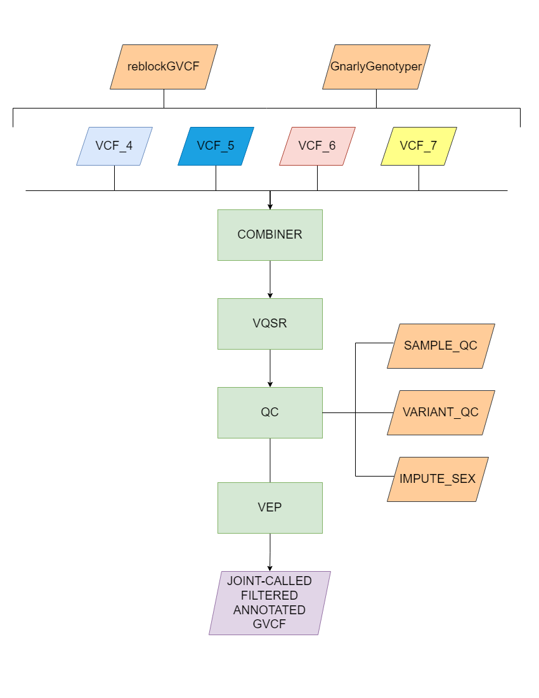

# **Hail-joint-caller**

## **Traditional Methods**
The code in this repository implements Hail and Apache Spark to solve the issues surrounding the traditional methods of joint-calling. The N+1 problem involves adding another sample to your cohort. Adding even a single sample requires you to re-call all samples from scratch again. This issue is compounded by the exponential scaling of computational time required as cohort size grows. Hail's new sparse matrix data format addresses this issue and enables the appending of existing joint-calls without re-processing, solving the N+1 problem.

## **Workflow**

### *Preprocessing*
It's a necessity that you run **reblockGVCF** and **VariantRecalibration** on your dataset prior to combining, otherwise VQSR will complain about the field QUALapprox being missing. 

With your preprocessed samples, you can put them through **combine_gvcf.py**. This script allows you to joint-call only a list of samples, a list of samples and existing Hail Matrix Tables (mts) and only existing mts. The output will be a sparse matrix table. This is Hail's new data format which allows you to simply append existing joint calls without re-processing, solving the N+1 problem. The sparse matrix table exploits the fact that GVCF files store information about the start of each reference block. These reference blocks are adjacent bases that are homozygous to the reference, spanning thousands to tens of thousands of bases. Hail achieves a lossless and less dense format by only storing the start and end positions of these reference blocks.

### *VQSR*
VQSR must be run external from Hail but can imported otherwise. Begin with **mt_to_vcf.py** to transform your joint-called cohort into a site-only VCF file. This is the input format that VQSR accepts. Following this, **load_vqsr.py** can be used to load the VQSR output into a ht to be combined with our original mt. The final step with **make_finalised_mt.py** achieves this joining process to give you a mt.

### *QC*
**QC_methods.py** will generate a mt containing sample and variant QC and impute sex. 

### *VEP*
Finally, you can run **VEP.py** to run VEP with any plugin on your mt. Note that the config files only work with a very specific format. Fields specified within your plugin line must case match what VEP expects. Also your vep_json_schema line must all be lowercase, excluding types.

## **Scripts Available**
Currently, processes are separated into their individual scripts. Each script can have its help message displayed by providing the "-h" flag.

### **combiner_gvcf.py**
<pre><code> A tool for utilising Hail for joint calling.

usage: combine_gvcf.py [-h] [--hdfs] [--overwrite] [--app_name app_name]
                       [--reference reference]
                       sample_map output [temp-dir]

positional arguments:
    sample_map            path to the file containing a list of samples
    output                path to the output file
    temp-dir              path for intermediate files

optional arguments:
    -h, --help            show this help message and exit
    --hdfs                sample_name_map points to samples stored on the hdfs
    --overwrite           overwrite existing output file
    --app_name app_name   name of the application
    --reference reference human genome reference to be used</code></pre>

### **mt_to_vcf.py**
<pre><code> A tool for converting a Hail mt to a site-only VCF.

usage: mt_to_vcf.py [-h] [--n_partitions n_partitions] [--app_name app_name]
                    [--hdfs] [--overwrite]
                    path_to_mt output

positional arguments:
    path_to_mt            path to the mt
    output                path to the output file

optional arguments:
    -h, --help            show this help message and exit
    --n_partitions n_partitions
                          number of partitions for output matrix table
    --app_name app_name   name of the application
    --hdfs                sample files are stored on the hdfs
    --overwrite           overwrite output file if it exists</code></pre>

### **load_vqsr.py**
<pre><code>A tool for converting a VQSR file to a ht.

usage: load_vqsr.py [-h] [--reference reference] [--app_name app_name]
                    [--overwrite] [--hdfs]
                    path_to_vqsr output

positional arguments:
    path_to_vqsr          path to the VQSR file of your mt
    output                path to final output destination

optional arguments:
    -h, --help            show this help message and exit
    --reference reference human genome reference to be used
    --app_name app_name   name of the application
    --overwrite           overwrite output file if it exists
    --hdfs                files are stored on the hdfs</code></pre>
### **make_finalised_mt.py**

<pre><code>A tool for generating the final annotated, soft-filtered Matrix Table.

usage: make_finalised_mt.py [-h] [--app_name app_name] [--hdfs] [--overwrite]
                            path_to_mt path_to_vqsr_ht output

positional arguments:
    path_to_mt           path to the matrix table generated by combiner
    path_to_vqsr_ht      path to the VQSR ht
    output               path to the final matrix table output destination

optional arguments:
    -h, --help           show this help message and exit
    --app_name app_name  name of the application
    --hdfs               files are stored on the hdfs
    --overwrite          overwrite existing output file</code></pre>

### **QC_methods.py**
<pre><code>A tool for utilising Hail for QC.

usage: QC_methods.py [-h] [--app_name app_name] [--hdfs] [--overwrite]
                     path_to_mt output

positional arguments:
    path_to_mt           path to the mt
    output               path to the output file

optional arguments:
    -h, --help           show this help message and exit
    --app_name app_name  name of the application
    --hdfs               files are stored on the hdfs
    --overwrite          overwrite output file if it exists</code></pre>

### **VEP.py**
Example config files can be found within the VEP-configs directory.
<pre><code>A tool for utilising VEP within Hail.

usage: VEP.py [-h] [--app_name app_name] [--hdfs] path_to_mt output config

positional arguments:
    path_to_mt           path to the mt
    output               path to the output file
    config               path to the config file

optional arguments:
    -h, --help           show this help message and exit
    --app_name app_name  name of the application
    --hdfs               files are stored on the hdfs</code></pre>

## **Jupyter Notebooks**
Notebooks have been written to demonstrate the inner workings of these scripts. They can be found within the notebooks directory.

## **Acknowledgements**
This project could not have been completed without the guidance of Joe Copty, Shyamsundar Ravishankar and Arash Bayat. The work completed by Vlad Savelyev to incorporate VQSR was also immensely helpful.

# **Disclaimer**
This code is bug free and any issues are almost definitely with the user. :smiley: